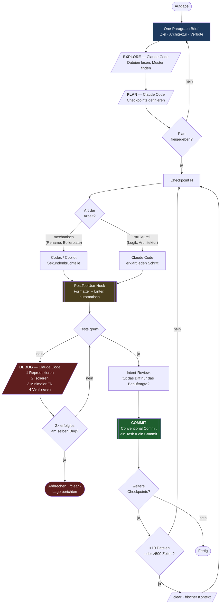

# Der hybride Workflow

Architektonische Intelligenz und mechanische Geschwindigkeit werden strikt getrennt.

## Rollenverteilung

| Werkzeug | Paradigma | Zuständig für | Nicht zuständig für |
|---|---|---|---|
| **GitHub Copilot** | Inline, reaktiv | In-Flow-Vervollständigung, Boilerplate, Testgerüste beim Tippen | Alles, was mehrere Dateien überspannt |
| **OpenAI Codex** | Autonom, latenzarm | Deterministische Batch-Operationen, Umbenennungen, vorhersehbare Logik | Architekturfragen, alles mit Begründungsbedarf |
| **Claude Code** | Agentisch, erklärend | Planung, Architektur, Debugging, Review, Commits | Zeichenweise Autovervollständigung |

Die drei konkurrieren nicht — sie decken verschiedene Phasen ab.

## Ablauf

## Die vier Kernregeln in einem Satz

1. **Kein Code vor dem Plan.** Checkpoints zuerst.
2. **Ein Task, ein Commit.** Sammeln heißt alles verlieren, wenn die letzte Änderung bricht.
3. **Ein Bug, ein Fix.** Mehrere gleichzeitig ergibt Fehlerkaskaden.
4. **Beweis statt Behauptung.** "Sollte gehen" zählt nicht.

## Kontext-Hygiene

Ab ~10 berührten Dateien oder ~500 geänderten Zeilen degradiert die Qualität messbar. Dann: committen, `/clear`, weiter. Steckt der Agent in einer Endlos-Korrekturschleife: `Ctrl+C`, `/clear`, mit präziserem Brief neu starten.
